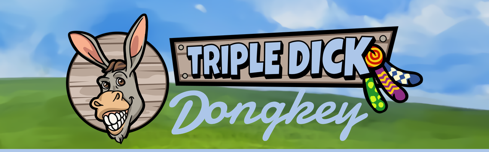

<!--
  Solicitor review before any material change goes live (docs/GITHUB_ORG.md §5).
  When the light/dark banner pair from GITHUB_ORG.md §3d is exported, swap the  below
  for a <picture> with prefers-color-scheme sources.
-->

  

**The most degen project on the most institutional chain in crypto.**

6,666 hand-drawn Dongkeys. Three dicks apiece. 
Living on Arc, the chain whose native currency is the dollar.

 

 

**[dongkeys.com](https://dongkeys.com)** · [@thedongkeys](https://x.com/thedongkeys)

 

---

## The premise

Arc is a layer 1 built to settle tokenised treasuries and move money between banks. Its
validators are the sort of institution with marble in the lobby. Gas is paid in USDC, so a
transaction costs a number of dollars rather than a fraction of something volatile.

We are putting 6,666 cartoon donkeys with three dicks each on it.

We are aware of the mismatch. It is the entire point, and it only works if we are genuinely on
the chain — deployed, verified on Arcscan, gas settled in USDC. Not bridged. Not Arc-adjacent.

Alongside the herd there is **$STABLE**: 666,666 tokens, fixed supply, mint renounced at
deploy. It is not a stablecoin. Obviously.

## The stock

| | |
|---|---|
| **Head** | 6,666. Hard capped in the constructor, immutable after deploy |
| **Appendages** | 19,998. Three apiece. It is the specification, not a surprise |
| **Traits** | 100+ across coats, backgrounds, headwear, eyewear and accessories |
| **Grades** | Burro → Mule → Jack → Stud → Champion |
| **Drawn by** | A person. Every line of it |

Zero AI was involved in this artwork. A human drew every dick. We consider this our core
technical differentiator.

## Disclosure schedule

This organisation publishes everything needed to verify the project. Radical transparency is
the least we owe anyone who buys one, and it is also funny.

The org was opened on 8 September 2026 and currently holds this repository and nothing else.
The table below is a commitment, not an inventory.

| Repository | Contents | Published |
|---|---|---|
| **`press-kit`** | Brand assets and wordmarks, licensed for memes | Before mint |
| **`contracts`** | Mint and token source, verified on Arcscan | Mint day |
| **`provenance`** | The pre-mint provenance hash and the commitment method | Mint day |
| **`generator`** | Reads the layers, enforces the caps, refuses to run if the numbers do not add up | After reveal |
| **`verify-your-dongkey`** | Recompute the hash yourself and confirm no rarity was rigged | After reveal |

Both contracts are audited before deploy and verified on-chain after it. Metadata is frozen
once the collection is revealed, and the freeze transaction is published.

## What is not in here

The art.

GitHub's acceptable use policy prohibits graphic sexual content, and it names drawings and
computer-generated images specifically. Our product is a cartoon donkey with three dicks.
There is no reading of that policy under which the collection belongs in this organisation, so
it is not here and it will not be.

It lives on [dongkeys.com](https://dongkeys.com), behind an age gate, which is where it
belongs anyway.

## Verifying us

**The contract address is published on [dongkeys.com](https://dongkeys.com) and nowhere else.**

- We will never DM you first.
- We will never announce a surprise mint, a second collection or a stealth drop.
- We will never ask you to connect a wallet to validate, verify or unlock anything.
- There is no allowlist form, no claim portal and no support agent.

Any link that is not `dongkeys.com` is somebody trying to take your money in a way we did not
plan. If it did not come from the site, it is not us.

  

---

$STABLE is not a stablecoin and is not pegged to anything. 
Nothing in this organisation is an offer, a solicitation or financial advice.

 

No affiliation with, endorsement by, or airdrop from Circle, Arc, OpenSea, or any of the 
extremely serious institutions validating the chain beneath our Dongkeys is implied or promised.

 

**Triple Dick Dongkey** — no Dongkeys were consulted.

