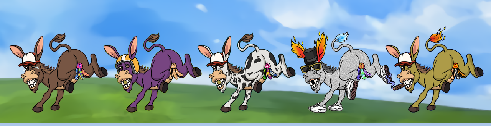

<!-- Renders at github.com/thedongkeys — this exact path (profile/README.md) is what GitHub looks for. -->

  

  <b>6,666 hand-drawn dongkeys. Three dicks each.</b> 
  Living on Arc, the chain whose native currency is the dollar.

  
  
  
  

  
  

  

---

Zero AI was involved in this artwork. A human drew every dick. We consider this our core
technical differentiator.

Arc is a layer 1 built to settle tokenised treasuries. Its validators are the sort of
institutions with marble in the lobby. We are putting cartoon donkeys with three dicks on it.
We are aware of the mismatch. It is the entire point.

## Disclosure schedule

This organisation publishes everything needed to verify the project, on the following schedule.
Radical transparency is the least we owe anyone who buys one, and it is also funny.

| Repository | Contents | Published |
|---|---|---|
| **`press-kit`** | Brand assets and wordmarks, licensed for memes | Now |
| **`contracts`** | Mint contract source, verified on-chain | Mint day |
| **`provenance`** | The pre-mint provenance hash and the commitment method | Mint day |
| **`verify-your-dongkey`** | Recompute the hash yourself and confirm no rarity was rigged | After reveal |
| Token and vesting contracts | Full source, lock and burn addresses | Token launch |

## Verifying us

**The contract address is published on [thedongkeys.com](https://thedongkeys.com) and nowhere
else.**

We will never DM you. We will never announce a surprise mint. We will never ask you to connect
a wallet to validate, verify or unlock anything. Any link that is not thedongkeys.com is
somebody trying to take your money in a way we did not plan.

  

---

Nothing in this organisation is financial advice, an offer, or a solicitation. 
No affiliation with, endorsement by, or airdrop from Arc, Circle, OpenSea, or any of the
extremely serious institutions validating the chain beneath our dongkeys is implied or
promised.

